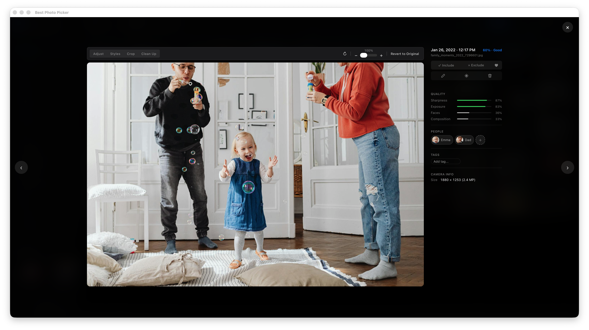
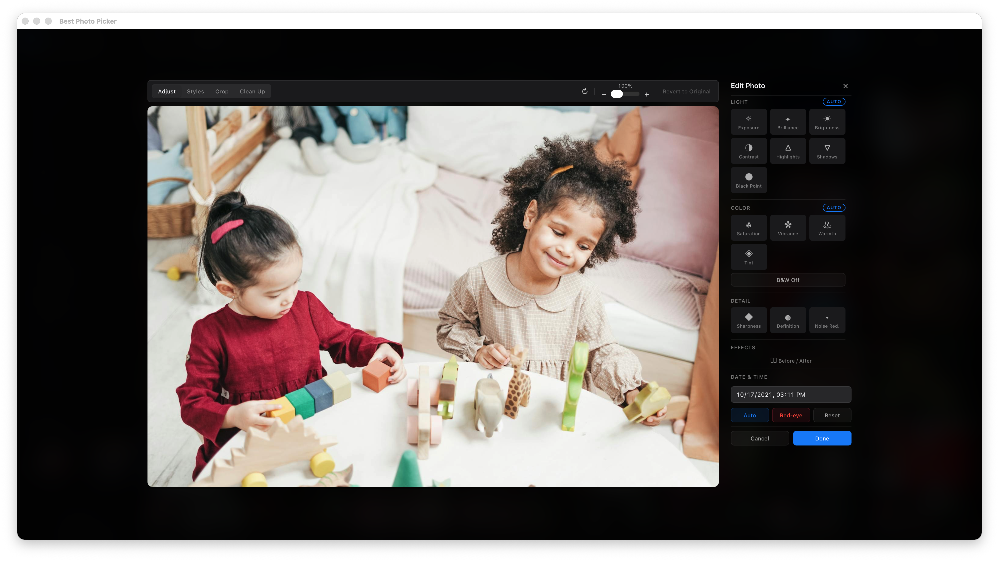
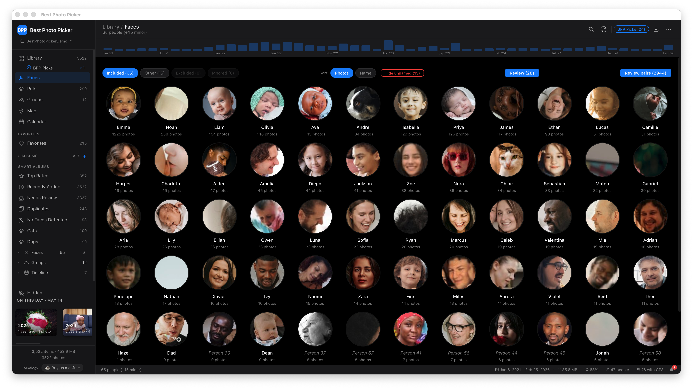
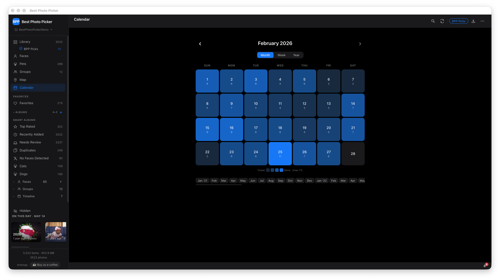
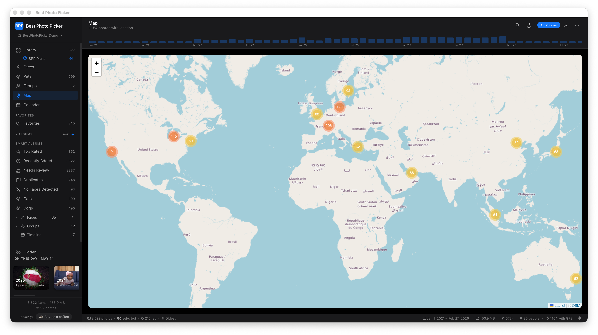
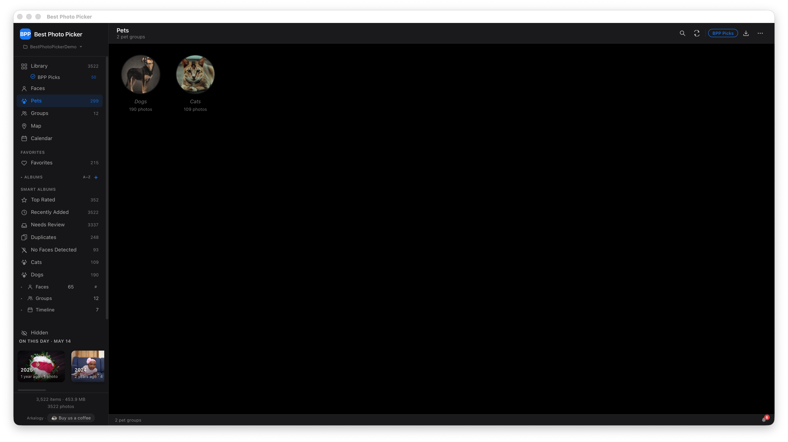
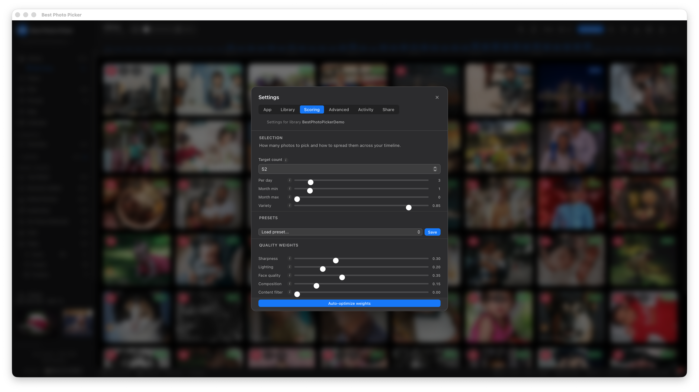

# Best Photo Picker — Visual Quickstart

A walkthrough of what BPP actually looks like in use. If you want to evaluate the product without running `pip install` first, this page is the next-best thing — it covers the core flow from import through pick and export, plus the side surfaces (faces, calendar, map, duplicates) that make a large library navigable.

For a 30-second hands-on trial with no setup, run:

```bash
pip install "bppicker[web]" && bpp demo
```

That generates a synthetic library and launches the full UI locally. Nothing leaves your machine.

---

## 1. Library grid


The grid is the home view: every photo in your library, with score badges in the corner of each thumbnail. Sort by date, score, or filename. Filter by selected / favorited / overridden / enhanced / RAW / video. Multi-select with Cmd-click for batch ops. The sidebar on the left is the album list — smart albums (Picks, Faces, Pets, Duplicates, Calendar, Favorites) plus any manual albums you've created.

## 2. BPP Picks — your best photos in one click


Picks is the headline feature: select the best K photos across the entire library by an aggregate score (sharpness + exposure + faces + composition), with per-day caps and monthly coverage so the selection stays temporally diverse instead of clumping into the best-lit afternoon. The toolbar at the top shows the active K, the picks-only filter chip, and the live recompute trigger. Adjust the scoring weights with the sliders — picks rebuild in real time.

## 3. Lightbox — full-size review



Press space or click a thumbnail to open the lightbox. Keyboard navigation (arrows for prev/next, escape to close). The right pane shows the per-photo metadata: aggregate score breakdown, EXIF, GPS, faces detected, similar photos. The toolbar below the image carries the per-photo actions (favorite, override include/exclude, edit, delete).

## 4. In-place editor



Non-destructive editing on top of the original file — crop, straighten, redeye removal, optional AI inpainting via [`bppicker[inpaint]`]. Edits are saved as a side-channel record, not written into the source bytes; the lightbox shows the edited preview but the original file on disk is untouched. The Reset button reverts; the Save button bakes the edit into a separate output when you export.

## 5. Face clustering



BPP detects faces during analysis (SCRFD + BlazeFace + dlib fallback) and clusters them automatically. Each cluster becomes a smart album. Name a cluster ("Leo") and every photo with that face is one click away. Merge, dismiss, reassign, or manually draw a missed face via the lightbox's face picker. The Picks recompute can be biased toward specific named people — "pick the 50 best photos of Leo" is literally one slider away.

## 6. Calendar view



For navigating by "I know it was around July." Photos grouped by month with thumbnail previews; click a day to filter the grid to that day. The temporal-diversity logic in Picks uses the same calendar data — every selected month has at least one representative photo.

## 7. Map view



GPS-tagged photos plotted on OpenStreetMap tiles. Pan and zoom to filter the grid by location. The map only fires tile fetches when you actually open the view — no background tile loading. (Map tiles are the one external network call BPP makes during normal browsing; everything else is local.)

## 8. Near-duplicate review


Burst photos and near-duplicates are clustered automatically by perceptual hash (dHash + aHash, Hamming distance ≤ 8). The Duplicates smart album shows the clusters; the review flow opens a side-by-side comparison so you can pick the keeper, mark the rest for deletion, and never see them in Picks again. CLIP semantic dedup runs on top of the hash-based pass for cases where the same shot was edited / cropped differently.

## 9. Pet detection



YOLOv11n detects cats and dogs in analyzed photos and clusters them by visual similarity. Each detected pet cluster becomes its own smart album. Useful for the surprisingly common "find the 30 best photos of the dog from last summer" case.

## 10. Settings



App-level settings (theme, update check, product tour) and library-level settings (extensions, scoring weights, dedup thresholds, ML model status) live here. Each ML model is opt-in — install via the Settings → Advanced → ML Models tab, with full per-model consent on the bytes that will be downloaded.

---

## Next steps

- **Try the demo** — `pip install "bppicker[web]" && bpp demo` boots a synthetic library and the full UI in about 30 seconds. No photos of yours, no setup, no install of optional ML extras required.
- **Install for real** — `pip install "bppicker[web,faces]"` then `bpp serve --library ~/Pictures/MyLibrary`. See the [README](../README.md) for details on optional extras (HEIC, NSFW filter, RAW, AI inpainting).
- **Read the architecture** — `docs/adr/` captures the load-bearing decisions; `docs/API.md` covers the HTTP surface for anyone integrating against the local server.
- **Contribute** — `CONTRIBUTING.md` for the workflow, `docs/plugins.md` for the registered extension points.
